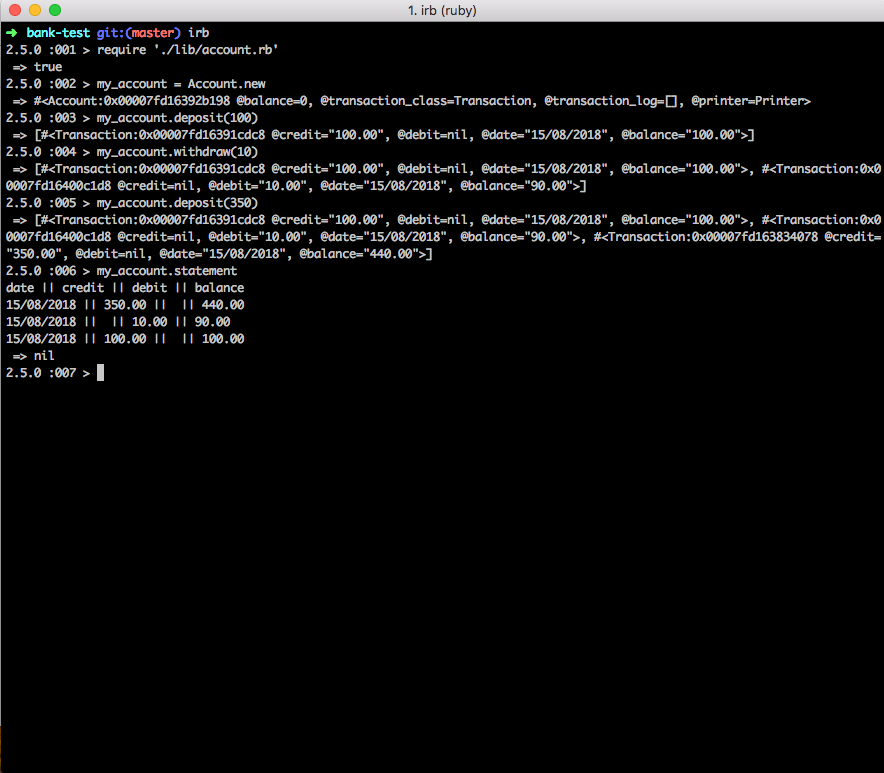

# Bank Tech Test

## Overview

A simple application that allows users to create an account to make bank deposits, withdrawals and print out statements. The app is built to run on command line interface. The specific requirements and acceptance criteria are as below:

## Installation and Launching App
```
git clone https://github.com/dct-lau17/bank-tech-test.git
cd bank-test
bundle install
irb
require './lib/account.rb'
```
run `rspec` to check tests and coverage

---------------
### Provided Requirements

* You should be able to interact with your code via a REPL like IRB or the JavaScript console.  (You don't need to implement a command line interface that takes input from STDIN.)
* Deposits, withdrawal.
* Account statement (date, amount, balance) printing.
* Data can be kept in memory (it doesn't need to be stored to a database or anything).

### Acceptance criteria

**Given** a client makes a deposit of 1000 on 10-01-2012  
**And** a deposit of 2000 on 13-01-2012  
**And** a withdrawal of 500 on 14-01-2012  
**When** she prints her bank statement  
**Then** she would see

```
date || credit || debit || balance
14/01/2012 || || 500.00 || 2500.00
13/01/2012 || 2000.00 || || 3000.00
10/01/2012 || 1000.00 || || 1000.00
```

-----------------

## Technology
- Ruby
- RSpec

## User Commands
To create a new account: `your_account_name = Account.new`  
To make a deposit: `your_account_name.deposit(100)`
To make a withdrawal: `your_account_name.withdraw(100)`
To view current balance: `your_account_name.balance`
To view your statement: `your_account_name.statement`

## Approach
1. User Stories- Broke the task into a user stories from an account holder perspective.
2. Decided to do this challenge using Ruby as it is my stronger language and since this is my first tech test practice it would be a good indicator.
3. I decided to use to implement 3 seperate classes:
  - Account: This is the main class that handles the user requests to print, withdraw, deposit and view your balance.
  - Transaction: When a deposit or withdrawal is made a new instance of transaction is created. This holds information of the type of transaction(credit/debit), the balance of the account at the time of the transaction and the date which is also created in this class.
  - Printer: This class takes in an array of transactions as an argument and formats them to a readable state for the end user.
4. This challenge was implemented using a TDD red-green-refactor approach.

### Assumptions
- User has no overdraft limit
- The minimum deposit amount is 1

### User Stories
```
As an account holder,
So that I can store my money in my account,
I want to be able to be able to deposit an amount.

As an account holder,
So that I can access my money in my account,
I want to be able to make a withdrawal.

As a forgetful account holder,
So that I do not withdraw money I do not have,
I want to be warned with an error message when I enter an amount over my balance.

As a clumsy account holder,
So that I do not mistakingly deposit an amount lower than the bank's min requirement,
I want to be warned with an error message,

As an account holder,
So that I can understand my account activities,
I want to be able to see my transaction log.

As an account holder,
So that I can show my wife I am being responsible with my money,
I want to be able to print a statement
```

## Example

